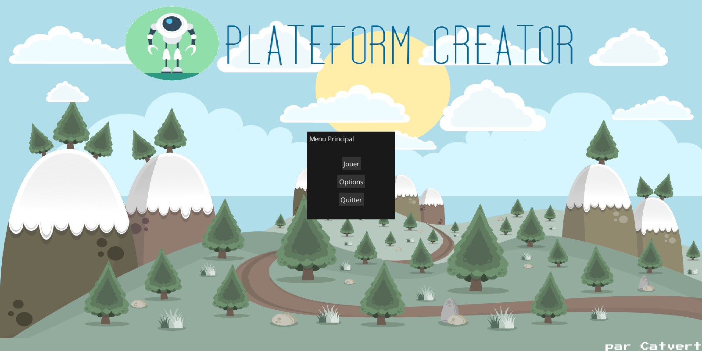
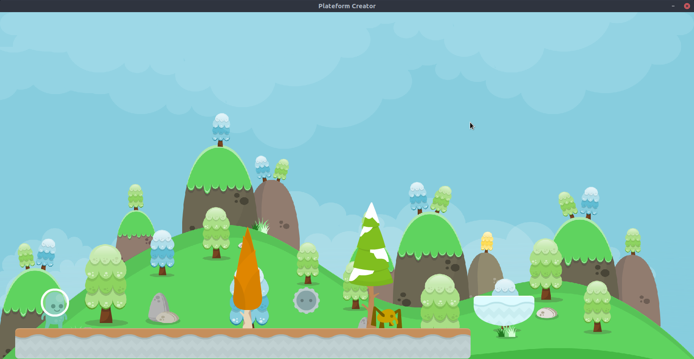
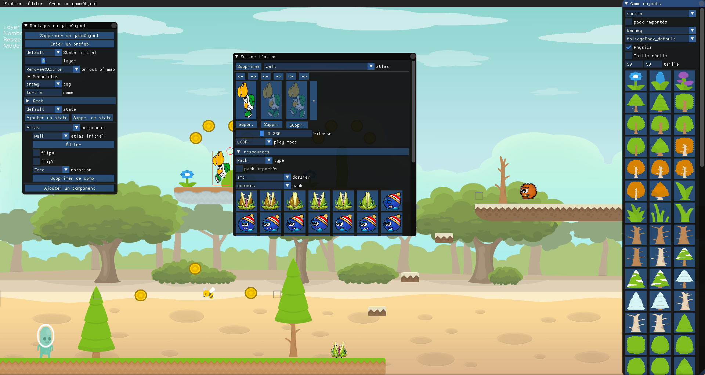

# Platform Creator

## Description du jeu
Platform creator est un jeu de plateforme utilisant les ressources de Kenney et SMC. Le jeu n'est pas encore totalement utilisable et de nombreux changements vont arriver.

## Licence

Ce programme est un logiciel libre: il peut être partagé et/ou modifié sous les termes de la Licence Publique Generale ( GNU ), publiée par la Foundation des logiciels libres, sous version 3 comme sous toutes autres futures versions.

Ce programme est distribué dans le but d'être utile, mais SANS AUCUNE GARANTIE; sans même la garantie de COMMERCIABILITE ou de CONVENIR A UNE CERTAINE TACHE. Regardez la licence publique générale GNU pour plus de détails.

Une copie de la Licence Publique Générale devrait vous être envoyée avec ce programme. Si ce n'est pas le cas, regardez [http://www.gnu.org/licenses/](http://www.gnu.org/licenses/).

## Licence

This program is free software: you can redistribute it and/or modify it under the terms of the GNU General Public License as published by the Free Software Foundation, either version 3 of the License, or (at your option) any later version.

This program is distributed in the hope that it will be useful, but WITHOUT ANY WARRANTY; without even the implied warranty of MERCHANTABILITY or FITNESS FOR A PARTICULAR PURPOSE. See the GNU General Public License for more details.

You should have received a copy of the GNU General Public License along with this program. If not, see [http://www.gnu.org/licenses/](http://www.gnu.org/licenses/).
